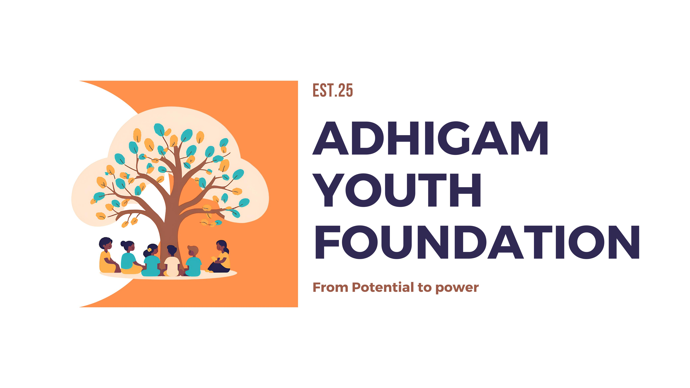

<div align="center">
  

  # Adhigam Youth Foundation
  
  **Empowering Communities Through Education, Awareness, and Skill Development.**

  [](https://react.dev/)
  [](https://vitejs.dev/)
  [](https://tailwindcss.com/)
  [](https://vercel.com/)
</div>

---

## 🌟 About The Project

Welcome to the new standard of the **Adhigam Youth Foundation** digital experience.

Originally built on foundational HTML, CSS, and vanilla JS, this project has been fully migrated and engineered into a blazing-fast **Single Page Application (SPA)** using **React**. The platform serves as the digital front door for the foundation, showcasing impact metrics, upcoming programs (like Kathak & Creative Learning), event details, and pathways for users to volunteer or donate.

We believe that seamless design matches seamless impact, and this application reflects exactly that.

---

## ✨ Features & User Experience

- **⚡ Blazing Fast Routing**: Entirely rebuilt in React 19 mapping to dynamic, no-reload localized sections.
- **🎨 Premium Visuals**: Structured with **Tailwind CSS**, featuring a custom color palette mapping to the foundation's branding guidelines.
- **✨ Organic Animations**: Fluid micro-interactions and scroll animations powered by **Framer Motion**.
- **📱 Fully Responsive**: 100% Mobile-first layout mapping across all devices dynamically.
- **🔍 SEO & Accessibility**: Semantic component hierarchy rendering out of the box ensuring screen-reader and search engine support.

---

## 🛠️ Technology Stack

The infrastructure represents the bleeding edge of modern web development:

| Technology | Purpose |
| :--- | :--- |
| **[React](https://react.dev/)** | Core UI Component Framework |
| **[Vite](https://vitejs.dev/)** | Lightning-fast Build Tool & Dev Server |
| **[TailwindCSS](https://tailwindcss.com/)** | Utility-first CSS framework for rapid UI styling |
| **[Framer Motion](https://www.framer.com/motion/)**| Production-ready declarative animation library |
| **[Lucide React](https://lucide.dev/)** | Beautiful, clean, and consistent iconography |

---

## 🎨 Design System

The application styling heavily revolves around Adhigam's organizational identity:

- 🌊 **Primary** (`#136a8a`): Trust, Professionalism, and Depth.
- 🍃 **Secondary** (`#267871`): Growth, Nature, and Foundation.
- ✨ **Accent** (`#ffd700`): Energy, Youth, and Value.

---

## 🚀 Local Deployment & Development

Want to run the foundation's app on your local machine? Setting it up is instant.

### Prerequisites
- [Node.js](https://nodejs.org/en/) (v18 or higher recommended)
- `npm` or `yarn` or `pnpm`

### Installation

1. **Clone the repository:**
   ```bash
   git clone https://github.com/Adhigam/Adhigam_Youth_Foundation.git
   cd Adhigam_Youth_Foundation
   ```

2. **Install dependencies:**
   ```bash
   npm install
   ```

3. **Start the development server:**
   ```bash
   npm run dev
   ```
   > The application will automatically open, typically at `http://localhost:5173`. Any changes to the code will hot-reload instantly.

### Build for Production
To build a highly optimized, minified production cache:
```bash
npm run build
```

---

## 📦 Architecture & Deployment Flow

*For a highly detailed technical breakdown, please consult our dedicated [ARCHITECTURE.md](ARCHITECTURE.md) file.*

This project utilizes **Vercel** for out-of-the-box CI/CD magic.
- Every commit pushed to the `main` branch automatically triggers Vercel.
- Vercel utilizes the local `vercel.json` to route client-side URLs backward gracefully, tracking the `dist` environment natively.
- No further hosting intervention required.

---

## 🔮 Roadmap & Upcoming Enhancements

We are continuously iterating to build a more powerful ecosystem for both our volunteers and those in need. Below is our active roadmap:

- 💳 **Integrated Payment Gateway**: Automating our donation processor directly within the UI (bringing back our Razorpay integration) to seamlessly accept online contributions.
- 📅 **Dynamic Event & Content Management**: Keeping all content sections (especially the *Events* and *Programs* components) freshly updated with our latest real-world activities.
- 🛠️ **Service & Maintenance Layer**: Implementing a persistent dashboard or routine workflows to manage the organization's evolving asset/services easily.
- 🚀 **Expanded Content Delivery**: Deepening the information presented in all sections, ensuring our real-world mission results are perfectly mirrored on our digital platform.

---

## 🤝 How You Can Contribute

Want to improve the website? We welcome PRs!

1. **Fork** the repository
2. **Create** your feature branch (`git checkout -b feature/AmazingUpgrade`)
3. **Commit** your changes (`git commit -m 'feat: Added an AmazingUpgrade'`)
4. **Push** to the branch (`git push origin feature/AmazingUpgrade`)
5. **Open** a Pull Request

---

## 💬 Let's Connect

**Built with ❤️ to empower communities through education and awareness.**

For organizational inquiries, support, or questions, please contact us:
📧 **Email**: info@adhigam.org
📞 **Phone**: +91 63923 32324